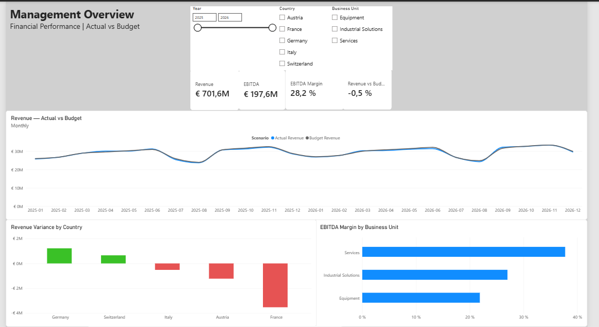
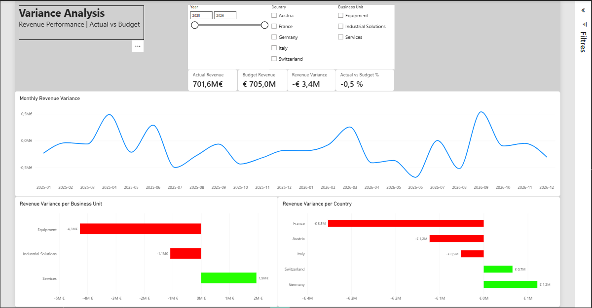

# Management P&L Dashboard

Interactive Power BI dashboard designed to provide management with a consolidated view of financial performance across countries and business units.

The dashboard focuses on financial performance monitoring, Actual vs Budget analysis, profitability and variance analysis.

---

## 1. Business Problem

Management reporting often requires Finance teams to consolidate financial information across multiple countries, business units and reporting periods.

A management dashboard should allow Finance and business stakeholders to quickly answer questions such as:

* Are we on track against Budget?
* Which countries or business units are driving the variance?
* How is financial performance evolving over time?
* Where should management focus its attention?

The objective is therefore not only to present financial data, but to transform it into actionable management information.

---

## 2. Objective

Build an interactive management P&L dashboard enabling Finance and management to:

* monitor financial performance;
* compare Actual results with Budget;
* analyse revenue and profitability;
* identify significant variances;
* analyse performance by country and business unit;
* understand the main drivers of performance.

---

## 3. Management Questions

The dashboard is designed around four main questions:

1. **Are we achieving our financial plan?**
2. **Where are the largest variances?**
3. **What are the main drivers behind these variances?**
4. **Which countries or business units require management attention?**

---

## 4. Solution

The solution combines:

**Synthetic financial data → Data preparation → Data model → DAX measures → Interactive Power BI dashboard**

The dashboard provides management-level KPIs together with detailed variance analysis by country, business unit and reporting period.

---

## 5. Dataset

The project uses a fully synthetic financial dataset created specifically for demonstration purposes.

The dataset covers:

* 24 months of financial data;
* 5 countries;
* 3 business units;
* 3 reporting scenarios;
* multiple P&L accounts.

### Countries

* Austria
* Germany
* France
* Italy
* Switzerland

### Business Units

* Industrial Solutions
* Services
* Equipment

### Scenarios

* Actual
* Budget
* Forecast

### P&L Accounts

The dataset includes revenue and operating cost categories used to calculate Gross Profit and EBITDA.

The dataset was generated using Python and validated before being imported into Power BI.

---

## 6. Key KPIs

The dashboard focuses on the following management KPIs:

### Revenue

Total revenue generated across the selected reporting scope.

### EBITDA

Operating profitability before depreciation, amortisation, interest and taxes.

### EBITDA Margin

EBITDA as a percentage of Revenue.

### Revenue Variance

Absolute difference between Actual Revenue and Budget Revenue.

### Revenue Variance %

Percentage variance between Actual Revenue and Budget Revenue.

The dashboard also supports filtering by year, country and business unit.

---

## 7. Dashboard Structure

### Page 1 — Management Overview

Executive-level view of financial performance.

Main elements:

* Revenue;
* EBITDA;
* EBITDA Margin;
* Revenue vs Budget;
* Revenue Variance by Country;
* EBITDA Margin by Business Unit.

The page is designed to provide a quick management overview of financial performance and highlight areas requiring further investigation.

### Page 2 — Variance Analysis

Detailed analysis of Revenue deviations versus Budget.

Analysis dimensions:

* Country;
* Business Unit;
* Month.

Main elements:

* Actual Revenue;
* Budget Revenue;
* Revenue Variance;
* Revenue Variance %;
* Revenue Variance by Country;
* Revenue Variance by Business Unit;
* Monthly Revenue Variance.

The objective is to identify where the largest positive and negative variances occur and how these variances evolve over time.

---

## 8. Dashboard Screenshots

### Management Overview



### Variance Analysis



---

## 9. Architecture

```text
Synthetic Financial Dataset
          │
          ▼
      Power Query
          │
          ▼
   Data Transformation
          │
          ▼
    Power BI Data Model
          │
          ▼
      DAX Measures
          │
          ▼
   Management Dashboard
          │
          ▼
    Variance Analysis
```

---

## 10. Tools & Technologies

* Power BI
* Power Query
* DAX
* Python
* CSV

Python is used to generate and validate the synthetic financial dataset.

Power Query is used for data preparation and transformation.

Power BI is used for data modelling, calculations, visualisation and management reporting.

DAX is used to create financial KPIs and variance measures.

---

## 11. Key Insights

The dashboard highlights several important performance patterns in the synthetic dataset.

### Country performance

France represents the largest negative Revenue variance versus Budget, at approximately **-€3.5M**.

Austria also shows a negative variance of approximately **-€1.0M**, while Italy is approximately **-€0.5M** below Budget.

Germany and Switzerland partially offset the negative performance, with positive variances of approximately **+€1.0M** and **+€0.65M** respectively.

### Management interpretation

The analysis demonstrates how a consolidated dashboard can quickly identify the main contributors to an overall Revenue variance.

Rather than focusing only on the total result, management can identify **where performance is deteriorating, where positive performance is offsetting the decline, and which areas require further investigation**.

---

## 12. Business Impact

This project demonstrates how a Power BI-based management reporting solution can improve:

* management visibility;
* variance analysis;
* identification of performance drivers;
* reporting consistency;
* decision-making.

The key value of the solution is not the visualisation itself, but the ability to transform financial data into structured management information and support targeted performance discussions.

---

## 13. Technical Details

Detailed technical documentation covers:

* data generation;
* Power Query transformations;
* data modelling;
* DAX measures;
* KPI calculations;
* variance analysis;
* dashboard design.

Technical details are intentionally presented after the business context to reflect a Finance-oriented approach.

---

## 14. Data Disclaimer

> **Synthetic financial dataset created for demonstration purposes.**

No confidential, proprietary or client data is used in this project.

All financial scenarios and figures are entirely fictional and have been created to demonstrate financial reporting, variance analysis and Business Intelligence capabilities.
