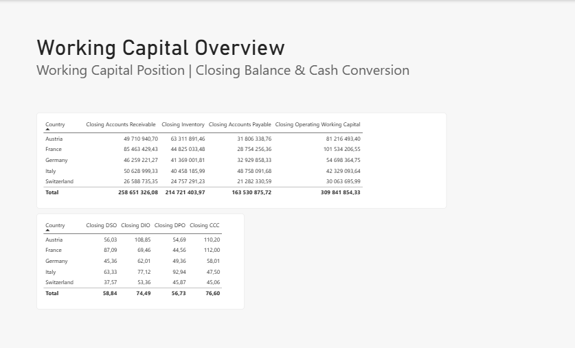
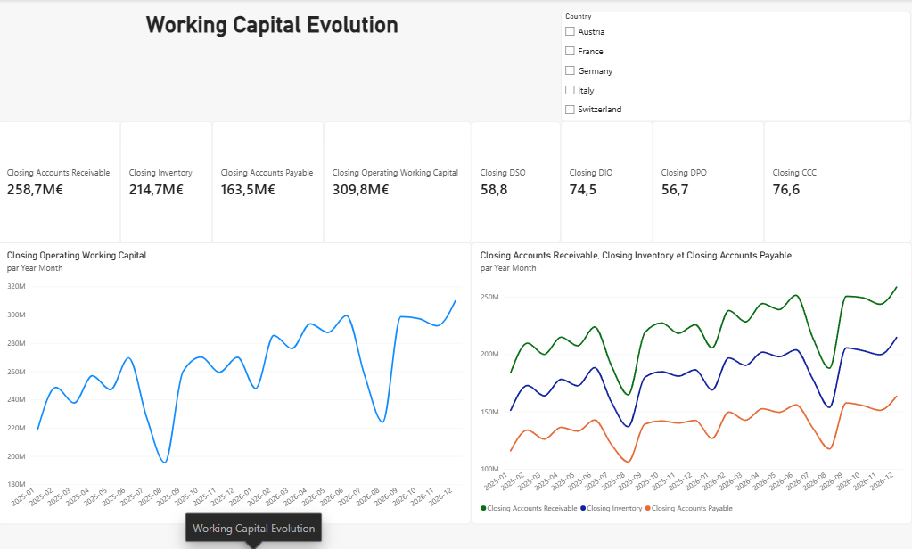
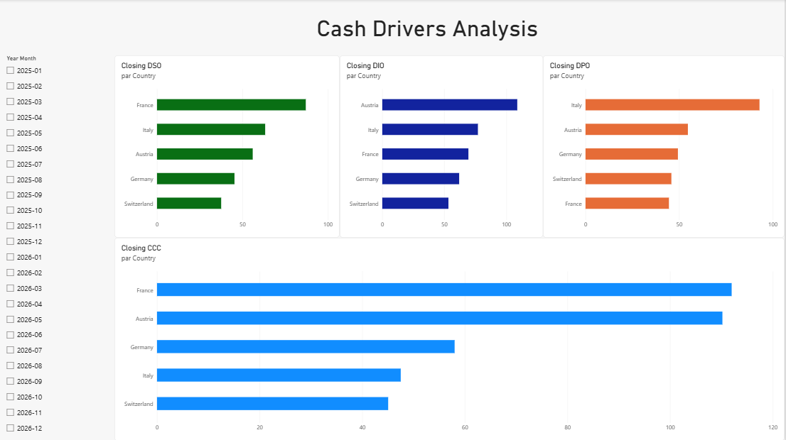

# Working Capital Dashboard

Interactive Power BI dashboard designed to analyse working capital, cash conversion and the operational drivers of cash immobilisation across countries and business units.

This project complements the **Management P&L Dashboard** by moving from **profitability analysis to cash generation**.

> **Revenue and EBITDA growth do not necessarily translate into cash generation.**

---

## 1. Business Problem

A company can generate strong revenue growth and remain profitable while significant amounts of cash are tied up in:

* Accounts Receivable
* Inventory
* Accounts Payable dynamics

Management therefore needs to understand not only profitability, but also how efficiently operational performance is converted into cash.

### Key Management Question

> **Where is cash currently tied up, and what is driving it?**

---

## 2. Objective

The objective of this project is to provide management with a structured view of working capital and its operational drivers.

The dashboard is designed to:

* Monitor Operating Working Capital
* Analyse Accounts Receivable, Inventory and Accounts Payable
* Monitor customer collection efficiency
* Analyse inventory efficiency
* Monitor supplier payment timing
* Measure the Cash Conversion Cycle
* Compare working capital performance across countries and business units
* Identify the main drivers of cash immobilisation

---

## 3. Key Financial Concepts

### Operating Working Capital

**Operating Working Capital = Accounts Receivable + Inventory − Accounts Payable**

This provides a view of the amount of cash invested in the company's operating cycle.

### DSO — Days Sales Outstanding

Measures the average number of days required to collect customer receivables.

**Higher DSO → more cash tied up in Accounts Receivable.**

### DIO — Days Inventory Outstanding

Measures how long inventory remains tied up before being sold.

**Higher DIO → more cash tied up in Inventory.**

### DPO — Days Payable Outstanding

Measures the average time taken to pay suppliers.

**Higher DPO → greater supplier financing.**

### CCC — Cash Conversion Cycle

**CCC = DSO + DIO − DPO**

The CCC measures the time required to convert operational investment into collected cash.

---

## 4. Solution

The project follows a finance-oriented data workflow:

**Synthetic Financial Data → Power Query → Data Model → DAX Measures → Power BI Dashboard → Financial Analysis**

The focus is not only on visualisation, but on transforming financial data into useful management information.

---

## 5. Dataset

The dataset is fully synthetic and was created specifically for demonstration purposes.

It contains:

* 24 monthly periods
* 5 countries
* 3 business units
* Revenue
* COGS
* Accounts Receivable
* Inventory
* Accounts Payable
* Operating Working Capital
* DSO
* DIO
* DPO
* CCC

### Countries

* Austria
* Germany
* France
* Italy
* Switzerland

### Business Units

* Industrial Solutions
* Services
* Equipment

The dataset was generated and validated using **Python and pandas**.

Validation checks include:

* Negative value checks
* Missing value checks
* Operating Working Capital formula validation
* CCC formula validation

---

## 6. Flow vs Balance-Sheet Items

An important financial modelling distinction is made between **flows** and **balances**.

Revenue is a **flow** generated throughout a period, so monthly revenue can be accumulated to calculate revenue over a year.

Inventory, Accounts Receivable and Accounts Payable are **balance-sheet positions** measured at a specific point in time.

Therefore, monthly balance-sheet values should not simply be summed across periods.

For management reporting, this project uses **closing balances** for the main working capital KPIs.

This distinction is important when designing financial reporting and calculating working capital ratios.

---

## 7. Key KPIs

The dashboard includes:

### Working Capital Balances

* Closing Accounts Receivable
* Closing Inventory
* Closing Accounts Payable
* Closing Operating Working Capital

### Cash Conversion Metrics

* Closing DSO
* Closing DIO
* Closing DPO
* Closing CCC

These KPIs allow management to move from the overall working capital position to the operational drivers behind cash conversion.

---

## 8. Dashboard Structure

### Page 1 — Working Capital Overview

Provides a high-level view of the working capital position and cash conversion metrics.

Key KPIs:

* Accounts Receivable
* Inventory
* Accounts Payable
* Operating Working Capital
* DSO
* DIO
* DPO
* CCC

### Page 2 — Working Capital Evolution

Focuses on the evolution of working capital over time.

Includes:

* Country slicer
* Closing Operating Working Capital over time
* Accounts Receivable / Inventory / Accounts Payable over time

This page helps identify changes in working capital and understand which balance-sheet components are driving the movement.

### Page 3 — Cash Drivers Analysis

Focuses on the operational drivers of cash conversion.

Includes:

* DSO by Country
* DIO by Country
* DPO by Country
* CCC by Country
* Country and period analysis

This page helps identify where cash is tied up and which operational driver requires management attention.

---

## 9. Dashboard Screenshots

### Working Capital Overview



### Working Capital Evolution



### Cash Drivers Analysis



---

## 10. Key Insights

The synthetic dataset was deliberately designed to illustrate different working capital profiles across countries.

The dashboard highlights:

* **France:** highest DSO, illustrating slower customer collection
* **Austria:** highest DIO, illustrating higher inventory exposure
* **Italy:** highest DPO, illustrating stronger supplier financing
* **Switzerland:** strongest overall cash conversion profile
* **France:** highest CCC in the analysed periods

These profiles are **illustrative assumptions built into the synthetic dataset**, rather than observations from a real company.

The dashboard allows management to identify the operational driver requiring attention rather than looking only at the overall working capital balance.

---

## 11. Architecture

```text
Synthetic Financial Dataset
            ↓
       Power Query
            ↓
      Data Transformation
            ↓
       Power BI Model
            ↓
        DAX Measures
            ↓
 Working Capital Dashboard
            ↓
    Financial Analysis
            ↓
    Management Insights
```

---

## 12. Tools

* **Power BI** — dashboard and data visualisation
* **Power Query** — data preparation and transformation
* **DAX** — financial KPI calculations
* **Python / pandas** — synthetic dataset generation and validation
* **CSV** — structured financial data source

Python is used as a supporting finance/data tool rather than as the primary focus of the project.

---

## 13. Business Impact

The project demonstrates how financial data can be transformed into actionable management information.

Potential business benefits include:

* Improved working capital visibility
* Identification of cash immobilisation drivers
* Country and business unit comparison
* Consistent KPI calculation
* Improved management reporting
* Support for cash optimisation initiatives
* Better connection between operational performance and cash generation

The core principle is:

> **Financial Data → Operational Drivers → Cash Impact → Management Action**

---

## 14. Technical Details

The project demonstrates:

* Financial data modelling
* Power Query data preparation
* Dimensional modelling
* Date table implementation
* DAX measures
* Financial KPI calculation
* Flow vs balance-sheet modelling
* Interactive filtering
* Management-oriented dashboard design
* Synthetic data generation and validation

Technical implementation is intentionally presented after the business context to reflect how finance transformation projects are approached in a professional environment.

---

## 15. Data Disclaimer

All data used in this project is synthetic and created exclusively for demonstration purposes.

No confidential, proprietary or client data has been used.

> **Synthetic financial dataset created for demonstration purposes.**
