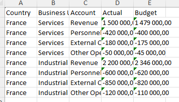
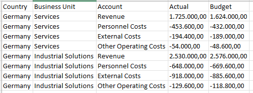
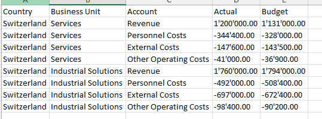
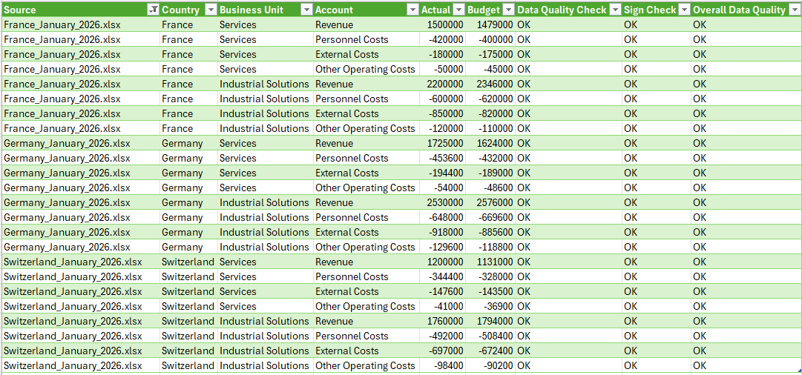
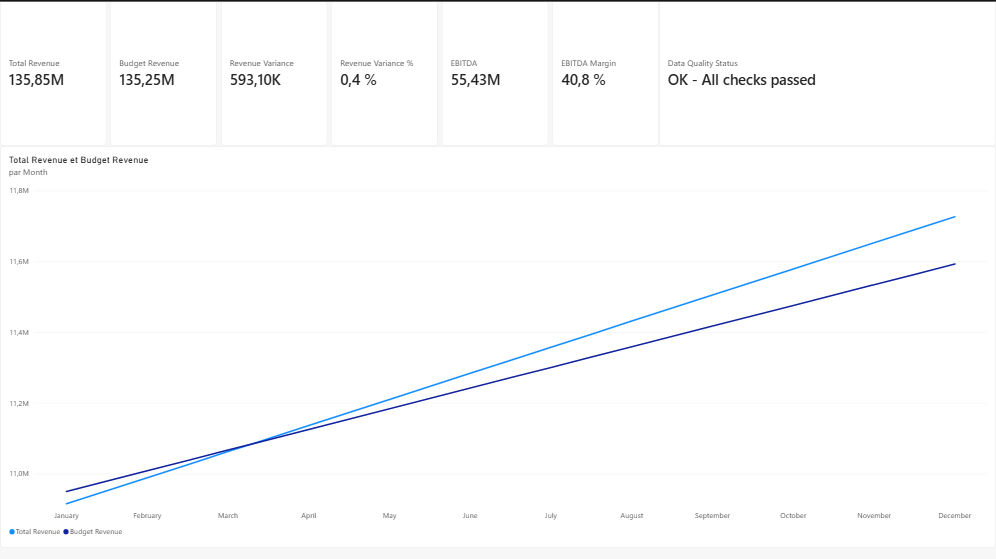
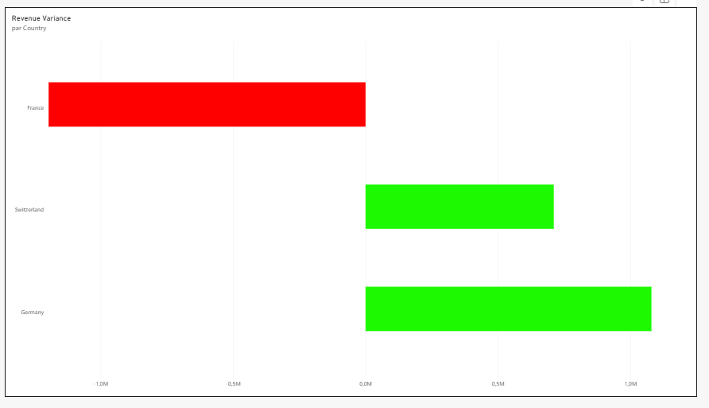
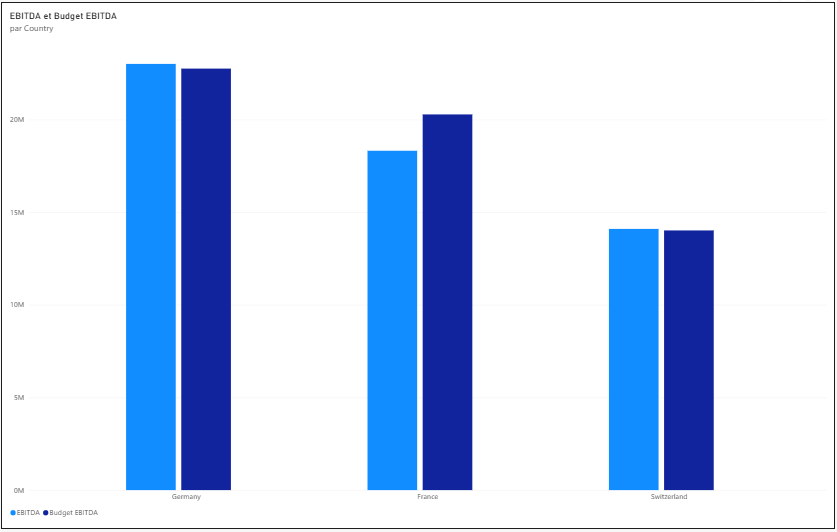

# Automated Financial Reporting

Automated financial reporting workflow designed to consolidate monthly financial data received from multiple countries, standardise heterogeneous number formats, perform data quality checks and produce consolidated management reporting.

The project focuses on **Finance Transformation, reporting automation and data quality**, using Power Query as the main transformation layer and Power BI as the reporting layer.

> **Business principle:** Automate the reporting process while maintaining data quality and control.

---

## 1. Business Problem

Monthly financial reporting often relies on multiple files received from different countries or entities.

These files may contain:

* different number formats;
* different decimal and thousands separators;
* country-specific reporting conventions;
* manual consolidation requirements;
* data quality risks;
* repetitive reporting tasks.

For example, the same financial amount can be represented differently depending on the country:

| Country     |  Source format |
| ----------- | -------------: |
| France      | `1 500 000,50` |
| Germany     | `1.500.000,50` |
| Switzerland | `1'500'000.50` |

Combining these files without properly standardising the financial amounts can lead to incorrect values and unreliable reporting.

The objective of this project is therefore not simply to combine Excel files, but to create a **controlled and repeatable financial reporting process**.

---

## 2. Objective

The solution was designed to:

* automate the consolidation of monthly financial files;
* standardise country-specific number formats;
* reduce manual data preparation;
* perform data quality checks;
* identify potential sign or missing-value issues;
* maintain source-file traceability;
* create a consolidated reporting dataset;
* provide management reporting through Power BI;
* allow the reporting process to be refreshed when source files change.

---

## 3. Solution

The complete workflow follows this architecture:

```text
Multiple Country Excel Files
            ↓
       Power Query
            ↓
   Data Standardisation
            ↓
    Data Quality Checks
            ↓
     Consolidated Dataset
            ↓
         Power BI
            ↓
    Financial Reporting
```

The key transformation and automation layer is **Power Query**.

Power BI is used as the final reporting and analysis layer.

The project therefore demonstrates the complete process from **raw financial data to management information**.

---

## 4. Source Data

The project uses synthetic monthly financial reporting files representing three countries:

* France
* Germany
* Switzerland

Each country provides one Excel file per month.

This results in:

* **3 countries**
* **12 months**
* **36 source files**

Each source file contains:

* Country
* Business Unit
* Account
* Actual
* Budget

Business Units:

* Services
* Industrial Solutions

Accounts:

* Revenue
* Personnel Costs
* External Costs
* Other Operating Costs

The financial profiles differ between countries, while each country retains its own local number format.

---

## 5. From Raw Files to Consolidated Reporting

### 5.1 Country-Level Source Files

The first step of the process is the collection of monthly Excel files from different countries.

The source files deliberately use different financial number formats.

### France

French financial amounts use a space as the thousands separator and a comma as the decimal separator.



### Germany

German financial amounts use a dot as the thousands separator and a comma as the decimal separator.



### Switzerland

Swiss financial amounts use an apostrophe as the thousands separator and a dot as the decimal separator.



These differences illustrate a common reporting challenge: **financial data may be structurally similar while its representation differs across entities or countries.**

---

### 5.2 Automated Consolidation with Power Query

Power Query imports the files from a folder and combines them into a single dataset.

The transformation process includes:

1. importing files from a folder;
2. combining the monthly files;
3. identifying the source file;
4. standardising country-specific number formats;
5. converting text amounts into numerical values;
6. applying data quality checks;
7. producing the consolidated dataset.

The resulting Working File contains the source traceability and control fields required for the reporting process.



The consolidated dataset includes:

```text
Source
Country
Business Unit
Account
Actual
Budget
Data Quality Check
Sign Check
Overall Data Quality
```

This creates a clear audit trail between the consolidated reporting dataset and the original source files.

---

### 5.3 Management Reporting in Power BI

The consolidated dataset is then used as the input for Power BI.

The purpose of the Power BI layer is not to perform the main data transformation, but to turn the controlled dataset into usable financial management information.

#### Financial Reporting Overview

The first page provides a consolidated view of:

* Total Revenue
* Budget Revenue
* Revenue Variance
* Revenue Variance %
* EBITDA
* EBITDA Margin
* Data Quality Status
* Revenue vs Budget



#### Revenue Variance by Country

The second page analyses revenue performance against budget by country.



#### EBITDA Performance by Country

The third page compares Actual EBITDA with Budget EBITDA by country.



---

## 6. Data Transformation

Power Query is responsible for the main transformation logic.

### Number Format Standardisation

Different transformation rules are applied depending on the country.

For example:

**France**

```text
1 500 000,50
        ↓
1500000.50
```

**Germany**

```text
1.500.000,50
        ↓
1500000.50
```

**Switzerland**

```text
1'500'000.50
        ↓
1500000.50
```

The standardised values are converted into numerical values that can be reliably aggregated and analysed.

This prevents the reporting layer from having to deal with country-specific text formats.

---

## 7. Data Quality Controls

Data quality controls were integrated directly into the transformation process.

### Missing Amounts

Financial records with missing Actual or Budget amounts are flagged.

### Sign Checks

The process verifies that:

* Revenue is not unexpectedly negative;
* operating cost accounts are not unexpectedly positive.

### Duplicate Validation

The source data was also tested for duplicate combinations of:

* Country
* Business Unit
* Account

The validation confirmed that the generated reporting records were unique at this level.

### Overall Data Quality

An overall status combines the relevant checks.

The Power BI report displays:

> **OK - All checks passed**

This provides a simple control indicator alongside the financial KPIs.

---

## 8. Refresh and Automation Test

The workflow was tested by modifying a source Excel file and refreshing the consolidated reporting file.

A Revenue amount in a source file was changed.

After refreshing the Working File:

```text
Source Excel File
        ↓
    Power Query
        ↓
Consolidated Dataset
        ↓
      Power BI
```

The updated financial amount was correctly reflected in the consolidated dataset.

The source value was subsequently restored and the workflow refreshed again.

This demonstrates that the process is **refresh-driven rather than manually consolidated**.

---

## 9. Key Results

The workflow successfully consolidates:

* **36 Excel source files**
* **3 countries**
* **12 monthly reporting periods**
* **288 financial records**

The process successfully:

* standardises different local number formats;
* converts financial amounts into numerical values;
* performs data quality checks;
* maintains source-file traceability;
* validates duplicate records;
* refreshes automatically when source data changes;
* feeds the consolidated dataset into Power BI.

---

## 10. Business Impact

The main value of the solution is the **automation and control of the reporting process**, rather than the visualisation layer alone.

The workflow helps to:

* reduce manual consolidation;
* improve reporting consistency;
* reduce formatting-related data risks;
* increase traceability;
* introduce repeatable data quality controls;
* simplify monthly reporting;
* provide a reliable dataset for management reporting.

The project demonstrates how Finance processes can be improved by combining:

**Financial knowledge + Data Transformation + Automation + Reporting**

---

## 11. Architecture

```text
                    RAW DATA
                       │
        ┌──────────────┼──────────────┐
        ↓              ↓              ↓
     France         Germany       Switzerland
     Excel           Excel           Excel
        └──────────────┼──────────────┘
                       ↓
                Folder Import
                       ↓
                  POWER QUERY
                       │
        ┌──────────────┼──────────────┐
        ↓              ↓              ↓
   File Combine   Standardisation   Data Controls
        └──────────────┼──────────────┘
                       ↓
             Consolidated Dataset
                       ↓
                    POWER BI
                       ↓
          Financial Management Reporting
```

---

## 12. Tools

* **Power Query** — data ingestion, transformation and standardisation
* **Power BI** — financial reporting and visualisation
* **DAX** — financial KPIs and variance calculations
* **Excel** — source reporting files
* **Python / openpyxl** — generation of synthetic source files

---

## 13. Technical Details

The project demonstrates practical use of:

* folder-based Power Query ingestion;
* automatic file combination;
* source-file traceability;
* conditional transformation rules;
* country-specific number format handling;
* text-to-number conversion;
* data quality validation;
* duplicate validation;
* DAX financial measures;
* Actual vs Budget analysis;
* EBITDA calculation;
* variance analysis;
* refresh-based automation.

The technical implementation is intentionally presented after the business problem and business impact.

The objective is to demonstrate how technical tools can support **financial process improvement**, rather than software development for its own sake.

---

## 14. Data Disclaimer

All financial data used in this project is synthetic and created exclusively for demonstration purposes.

No confidential, proprietary or client data from previous employers has been used.

> **Synthetic financial dataset created for demonstration purposes.**
