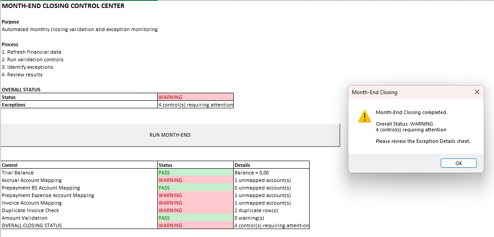
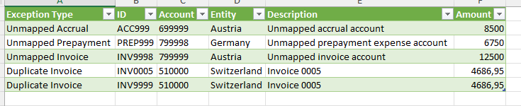
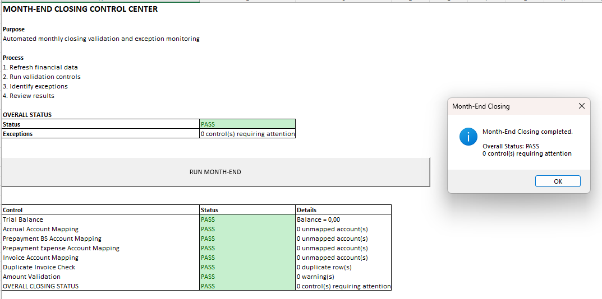

# Month-End Closing Automation

## Overview

This project simulates an automated **month-end closing and financial control process** for a multi-entity organization.

The objective is to combine financial data preparation, validation controls, exception management and reporting into a structured closing workflow.

The solution uses **Python, Excel, Power Query and VBA** to automate repetitive activities while keeping the process understandable and usable for a Finance Controller or Finance Manager.

> **Finance → Data → Controls → Automation → Reporting**

All financial data used in this project is synthetic and was created exclusively for demonstration purposes.

---

## Business Problem

Month-end closing requires Finance teams to collect information from multiple sources, validate accounting data, identify exceptions and ensure that financial information is reliable before reporting.

Typical challenges include:

* Multiple source files
* Inconsistent or missing account mappings
* Duplicate transactions
* Incorrect or invalid amounts
* Manual validation procedures
* Limited visibility over unresolved exceptions
* Repetitive closing activities
* Risk of errors during data consolidation

A Finance Controller needs to ensure that these issues are identified **before financial results are finalized and communicated to management**.

This project therefore focuses on the automation of the **control and validation layer of the month-end closing process**.

---

# Objective

The objective is to build a reproducible month-end closing workflow that can:

1. Import financial data from multiple sources
2. Standardize and transform the data
3. Validate accounting mappings
4. Detect potential duplicate transactions
5. Validate transaction amounts
6. Identify exceptions
7. Consolidate control results
8. Provide an overall closing status
9. Allow the process to be executed through a single button
10. Provide detailed information for exception investigation

The final output is a simple **Month-End Control Center** designed for Finance users.

---

# Process Architecture

```text
                    SOURCE DATA
                        │
        ┌───────────────┼────────────────┐
        │               │                │
        ▼               ▼                ▼
 Trial Balance      Accruals        Prepayments
        │               │                │
        └───────────────┼────────────────┘
                        │
                        ▼
                    Invoices
                        │
                        ▼
                  POWER QUERY
                        │
          ┌─────────────┼─────────────┐
          │             │             │
          ▼             ▼             ▼
      Mapping       Validation     Duplicate
       Checks         Checks        Detection
          │             │             │
          └─────────────┼─────────────┘
                        │
                        ▼
                CLOSING CONTROL
                        │
             ┌──────────┴──────────┐
             ▼                     ▼
      Exception Details      Overall Status
             │                     │
             └──────────┬──────────┘
                        ▼
             MONTH-END CONTROL CENTER
                        │
                        ▼
                 RUN MONTH-END
```

---

# Source Data

The process uses four synthetic financial data sources.

| Source        | Purpose                       | Records |
| ------------- | ----------------------------- | ------: |
| Trial Balance | General ledger balances       |      80 |
| Accruals      | Month-end accrual entries     |      36 |
| Prepayments   | Prepaid expenses              |      21 |
| Invoices      | Supplier invoice transactions |      32 |

The dataset represents four entities:

* Austria
* Germany
* France
* Switzerland

The data is intentionally designed to contain both **clean transactions and predefined exceptions** so that the control framework can be tested.

---

# Financial Control Framework

The project includes several automated controls designed to reproduce typical month-end validation activities.

## 1. Trial Balance Check

The Trial Balance is checked to ensure that total debits and credits are balanced.

### Control logic

```text
Total Debit - Total Credit = 0
```

### Expected result

`PASS`

This control provides a basic accounting integrity check before proceeding with the closing process.

---

## 2. Accrual Account Mapping

Accrual transactions are matched against the Trial Balance using:

```text
Account + Entity
```

This ensures that the account exists for the relevant entity.

An unmapped account generates:

```text
WARNING - Unmapped Account
```

---

## 3. Prepayment Account Mapping

Prepayments contain two accounting dimensions:

* Balance Sheet account
* Expense account

Both accounts are validated against the Trial Balance.

The process therefore checks:

```text
BS Account + Entity
```

and:

```text
Expense Account + Entity
```

This helps identify missing or incorrectly configured expense accounts.

---

## 4. Prepayment Account Structure Check

The process also verifies that the Balance Sheet account and Expense account are not identical.

Example:

```text
BS Account = Expense Account
```

generates:

```text
WARNING - Same Account
```

This represents an additional structural validation of the accounting entry.

---

## 5. Invoice Account Mapping

Invoice accounts are matched against the Trial Balance using:

```text
Account + Entity
```

An invoice referencing an account that does not exist in the master data generates an exception.

---

## 6. Duplicate Invoice Detection

The process identifies potential duplicate invoices using selected transaction attributes.

The duplicate control is separated into a dedicated query:

```text
Invoices - check duplicate
```

This allows potential duplicates to be investigated without altering the original invoice dataset.

---

## 7. Amount Validation

Accruals, prepayments and invoices are checked for invalid amounts.

The current validation identifies:

```text
Amount <= 0
```

as a warning condition.

This provides a basic transaction-level data quality control.

---

# Exception Management

Identified exceptions are consolidated into a dedicated:

```text
Exception Details
```

output.

The report contains:

| Field          | Purpose                       |
| -------------- | ----------------------------- |
| Exception Type | Type of control failure       |
| ID             | Source transaction identifier |
| Account        | Relevant accounting account   |
| Entity         | Legal entity                  |
| Description    | Transaction description       |
| Amount         | Financial value               |

This allows the Finance user to move from:

```text
WARNING
```

to:

```text
Exception Details
```

and investigate the underlying transactions.

---

# Closing Control

All individual controls are consolidated into a single control table.

Example:

| Control                            | Status  |
| ---------------------------------- | ------- |
| Trial Balance                      | PASS    |
| Accrual Account Mapping            | WARNING |
| Prepayment BS Account Mapping      | PASS    |
| Prepayment Expense Account Mapping | WARNING |
| Invoice Account Mapping            | WARNING |
| Duplicate Invoice Check            | WARNING |
| Amount Validation                  | PASS    |

The process then calculates an overall closing status.

### Overall Status Logic

```text
No warnings
     ↓
   PASS
```

```text
One or more warnings
     ↓
  WARNING
```

The purpose is not to automatically approve or reject the financial close, but to provide a **structured control framework highlighting items requiring Finance review**.

---

# Month-End Control Center

The workbook includes a dedicated:

**Month-End Control Center**

designed as the main user interface.

It provides:

* Overall closing status
* Number of controls requiring attention
* Individual control results
* Control details
* Access to exception information
* `RUN MONTH-END` execution button

The user does not need to interact directly with the underlying Power Query queries to run the process.

### Example workflow

```text
RUN MONTH-END
      ↓
Refresh source data
      ↓
Execute validation controls
      ↓
Consolidate results
      ↓
Check overall status
      ↓
PASS / WARNING
```

---

# Automation with VBA

VBA is used as an orchestration layer rather than as the main data-processing engine.

The `RunMonthEnd` macro:

1. Starts the workbook refresh
2. Waits for the refresh process to complete
3. Retrieves the closing status
4. Retrieves the control summary
5. Displays the final result to the user
6. Directs the user toward the exception report when required

This keeps the financial transformation logic primarily within **Power Query**, while VBA provides a simple execution interface.

The VBA source code is available in:

```text
VBA/RunMonthEnd.bas
```

---

# Data Preparation with Python

Python is used to generate the synthetic financial source files.

The script:

```text
script/generate_closing_data.py
```

creates:

* Trial Balance
* Accruals
* Prepayments
* Invoices

It also introduces predefined exceptions for testing purposes.

This makes the project:

* Reproducible
* Testable
* Independent from confidential company data
* Easy to regenerate

Python is therefore used as a **data-generation and testing tool**, not as the primary financial reporting platform.

---

# Testing Framework

The closing process was tested using two scenarios.

## Scenario 1 — Clean Data

The synthetic exceptions are removed or corrected.

Expected result:

```text
OVERALL STATUS = PASS
```

All controls should return `PASS`.

---

## Scenario 2 — Exception Data

The synthetic dataset contains predefined anomalies.

The model is designed to identify:

### Accrual

```text
Unmapped accrual account
```

### Prepayment

```text
Unmapped expense account
```

### Invoice

```text
Unmapped invoice account
```

### Duplicate

```text
Potential duplicate invoice
```

Expected result:

```text
OVERALL STATUS = WARNING
```

The corresponding transactions are then available in the `Exception Details` output.

---

# Screenshots

## Month-End Control Center — Warning

The control center identifies controls requiring Finance review.



---

## Exception Details

The exception report provides the detailed transactions identified by the automated controls.



---

## Month-End Control Center — Pass

After correcting the synthetic exceptions, the process returns to a clean closing status.



---

# Business Impact

This project demonstrates how a repetitive month-end control process can be standardized and partially automated.

Potential benefits include:

### Efficiency

Reduce repetitive manual validation activities during the closing process.

### Data Quality

Identify missing account mappings, duplicate transactions and invalid amounts earlier.

### Control Reliability

Apply standardized validation rules consistently across multiple entities.

### Exception Management

Provide a structured list of transactions requiring investigation.

### Reporting Readiness

Provide Finance with a clear indication of whether the dataset is ready for further reporting or requires additional review.

The project is a portfolio simulation and therefore does not claim a quantified real-world time or cost saving.

---

# Finance Skills Demonstrated

This project demonstrates knowledge across several Finance areas:

### Financial Controlling

* Month-end closing
* Financial data validation
* Accounting data analysis
* Exception investigation
* Reporting readiness

### Internal Controls

* Control design
* Data quality checks
* Account mapping
* Duplicate detection
* Exception monitoring

### Finance Transformation

* Process automation
* Standardization
* Workflow design
* Reduction of manual activities
* Reproducible processes

### Data & BI

* Power Query
* Data transformation
* Data modelling
* Excel
* VBA
* Python

---

# Technology Stack

| Technology   | Role                                  |
| ------------ | ------------------------------------- |
| Excel        | Financial control environment         |
| Power Query  | Data ingestion and transformation     |
| VBA          | Process orchestration                 |
| Python       | Synthetic data generation and testing |
| Git / GitHub | Version control and documentation     |

---

# Project Structure

```text
04-month-end-closing-automation/
│
├── README.md
│
├── Month_End_Closing_Automation.xlsm
│
├── data/
│   ├── Trial_Balance_December_2025.xlsx
│   ├── Accruals_December_2025.xlsx
│   ├── Prepayments_December_2025.xlsx
│   └── Invoices_December_2025.xlsx
│
├── screenshots/
│   ├── month-end-control-center-warning.png
│   ├── exception-details.png
│   └── month-end-control-center-pass.png
│
├── script/
│   └── generate_closing_data.py
│
└── VBA/
    └── RunMonthEnd.bas
```

---

# Key Takeaways

This project demonstrates a finance-oriented approach to automation:

```text
Financial Process
       ↓
Data Preparation
       ↓
Control Framework
       ↓
Exception Detection
       ↓
Automation
       ↓
Management Visibility
```

The objective is not to replace Finance judgment with automation.

Instead, automation is used to make the closing process **more structured, repeatable and transparent**, allowing Finance professionals to focus their time on investigating exceptions and analysing financial performance.

---

# Disclaimer

All financial data, entities, transactions, account numbers and exceptions used in this project are fictional and were created exclusively for portfolio demonstration purposes.

No confidential, proprietary or client data has been used.

The project is a simulation and does not represent the actual systems, processes or data of any employer or client.
