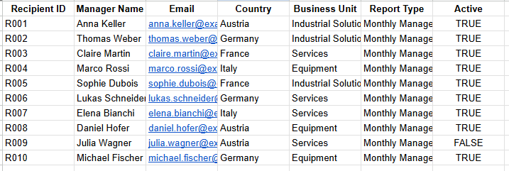
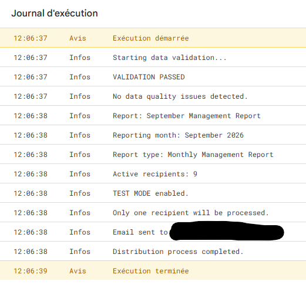
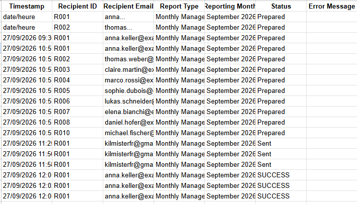

# Automated Management Reporting Distribution

## Business Problem

Monthly financial reporting often requires repetitive manual communication activities:

* identifying the relevant recipients;
* checking reporting cycles and deadlines;
* preparing standardised messages;
* distributing reports to the appropriate managers;
* tracking whether the communication was successfully completed.

Although these activities are operationally simple, they can create unnecessary manual workload and increase the risk of missed recipients, inconsistent communication or limited traceability.

## Objective

The objective of this project is to automate the distribution of monthly management reporting using Google Apps Script.

The solution is designed to:

* centralise recipient and reporting information;
* identify the appropriate reporting cycle;
* validate key master data before distribution;
* generate standardised management communication;
* automate the distribution process;
* record execution results in a dedicated log.

## Solution

The process follows this workflow:

```text
Master Data
     │
     ▼
Data Validation
     │
     ▼
Reporting Calendar
     │
     ▼
Report Selection
     │
     ▼
Email Generation
     │
     ▼
Automated Distribution
     │
     ▼
Execution Log
```

The solution separates business data from the automation logic, making the process easier to maintain and adapt.

## Tools

* Google Sheets
* Google Apps Script
* JavaScript
* Gmail

## Architecture

The solution is based on three Google Sheets tabs:

### 1. Recipients

Contains the reporting distribution master data:

* Recipient ID
* Manager Name
* Email
* Country
* Business Unit
* Report Type
* Active status

### 2. Reporting Calendar

Contains the reporting schedule:

* Reporting Month
* Report Type
* Planned Send Date
* Report Name
* Status

### 3. Execution Log

Provides process traceability:

* Timestamp
* Recipient ID
* Recipient Email
* Report Type
* Reporting Month
* Status
* Error Message

## Key Features

* Monthly reporting calendar
* Recipient master data
* Active recipient filtering
* Data quality validation
* Invalid email detection
* Duplicate recipient ID detection
* Report type validation
* Reporting date validation
* Automated email generation
* Automated distribution
* Execution logging
* Error handling
* Controlled test mode

## Data Quality Controls

Before any distribution takes place, the script performs validation checks on the reporting master data.

Examples include:

* missing Recipient IDs;
* duplicate Recipient IDs;
* missing email addresses;
* invalid email formats;
* unknown report types;
* invalid reporting dates.

If a validation error is detected, the distribution process is stopped before any email is sent.

This control approach is designed to reduce operational risk and improve the reliability of the reporting process.

## Business Value

The automation is designed to reduce repetitive manual tasks while improving the consistency and traceability of the reporting distribution process.

Potential benefits include:

* reduced manual workload;
* standardised communication;
* lower risk of missed recipients;
* improved data quality controls;
* improved process traceability;
* easier maintenance of reporting distribution rules.

The project demonstrates how automation can be used as a finance process improvement tool rather than as a standalone programming exercise.

## Screenshots

### Master Data


### Automated Distribution



### Execution Log



## Technical Details

The automation is implemented using Google Apps Script.

The script reads structured master data from Google Sheets and applies validation, reporting calendar and recipient rules before generating and distributing the appropriate communication.

The code is maintained separately from the business data to improve maintainability and scalability.

The project also includes a controlled test mode to prevent accidental distribution during development and testing.

## Data

All data used in this project is synthetic and created for demonstration purposes.

No confidential, company-specific or client data is used.

> **Synthetic financial dataset created for demonstration purposes.**

## Project Status

**Completed**

The automation has been developed and tested successfully.

Testing covered:

* successful data validation;
* successful report identification;
* successful email generation;
* successful test email distribution;
* execution logging;
* controlled handling of invalid email data.

The project is maintained as part of a Finance Automation & Business Intelligence portfolio.
