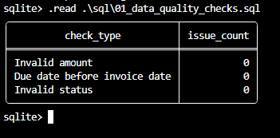
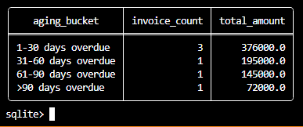
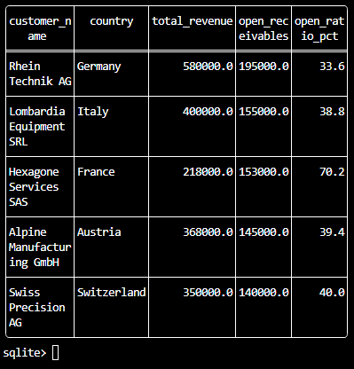

# SQL Financial Analysis & Receivables Monitoring

## Business Problem

Finance teams need reliable and timely analysis of revenue, accounts receivable and collection risk.

SQL can help Finance teams transform transaction-level financial data into structured management information while performing basic data quality checks.

This project simulates an international industrial company using a fully synthetic financial dataset.

The focus is not on programming itself, but on using **SQL as a Finance tool** for:

* Financial analysis
* Data quality
* Receivables monitoring
* Risk identification
* Management reporting

---

## Objective

The project aims to:

* Validate financial data quality
* Analyse revenue by customer, country and month
* Monitor open accounts receivable
* Identify overdue invoices
* Build an accounts receivable aging analysis
* Identify customer concentration
* Highlight potential collection risks
* Translate transactional data into management insights

---

## Solution

A SQLite database was created using two main tables:

* `customers`
* `invoices`

Five SQL scripts were developed to progressively transform the transactional data into financial analysis.

### Architecture

```text
Synthetic Financial Data
        ↓
SQLite Database
        ↓
Data Quality Checks
        ↓
Revenue Analysis
        ↓
Receivables Analysis
        ↓
Aging Analysis
        ↓
Management Insights
```

---

## Key Results

| KPI                                  |  Result |
| ------------------------------------ | ------: |
| Total revenue                        | €1.916M |
| Open receivables                     |   €788k |
| Open invoices                        |       6 |
| Receivables >60 days overdue         |   €217k |
| Receivables >90 days overdue         |    €72k |
| Top 2 customer revenue concentration |   51.2% |

### Key Management Insight

**Hexagone Services SAS has an open receivables ratio of 70.2%.**

This is significantly higher than the other customers and represents a potential collection risk requiring further investigation.

The aging analysis shows:

* €376k overdue by 1–30 days
* €195k overdue by 31–60 days
* €145k overdue by 61–90 days
* €72k overdue by more than 90 days

This allows Finance to prioritise collection actions based on both **amount and aging**.

---

## Data Quality

Before performing the financial analysis, basic validation checks were performed on the invoice dataset.

The following controls were implemented:

* Invalid or non-positive invoice amounts
* Due dates before invoice dates
* Invalid invoice statuses

### Result

**All data quality checks returned 0 issues.**

This illustrates an important principle of financial reporting:

> Reliable management information depends on reliable underlying data.



---

## Financial Analysis

### Revenue Analysis

Revenue was analysed by:

* Customer
* Country
* Month
* Customer revenue concentration

The two largest customers represent **51.2% of total revenue**, highlighting a potential concentration risk.

### Receivables Analysis

Open receivables were analysed by:

* Customer
* Country
* Invoice
* Payment status

The analysis identified **€788k of open receivables**.

### Aging Analysis

Open receivables were classified into:

* 1–30 days overdue
* 31–60 days overdue
* 61–90 days overdue
* More than 90 days overdue

This provides a practical view of collection risk and helps Finance prioritise follow-up actions.



---

## Management Analysis

The final analysis combines revenue, open receivables and the open receivables ratio by customer.

This makes it possible to identify customers where a significant proportion of generated revenue remains unpaid.

**Example:**

Hexagone Services SAS:

* Revenue: €218k
* Open receivables: €153k
* Open receivables ratio: 70.2%

This type of analysis could support:

* Collection prioritisation
* Cash flow monitoring
* Customer risk assessment
* Working capital management
* Management discussions



---

## Management Perspective

The project demonstrates how transactional financial data can be transformed into actionable management information.

A Financial Controller could use this type of analysis to:

* Identify collection priorities
* Monitor customer payment behaviour
* Detect customer concentration risks
* Support cash flow monitoring
* Challenge unusual receivables positions
* Improve financial reporting quality
* Support working capital discussions

The objective is therefore not simply to query a database, but to transform:

**Finance Data → Analysis → Risk Identification → Management Action**

---

## Tools

* SQLite
* SQL
* PowerShell
* Git / GitHub

---

## SQL Concepts Demonstrated

The project uses:

* `SELECT`
* `WHERE`
* `GROUP BY`
* `ORDER BY`
* `SUM`
* `COUNT`
* `CASE WHEN`
* `JOIN`
* Subqueries
* Date functions
* Data quality checks

---

## Project Structure

```text
06-sql-financial-analysis/
│
├── README.md
│
├── data/
│   └── financial_data.db
│
├── screenshots/
│   ├── data-quality-checks.png
│   ├── receivables-aging.png
│   └── management-analysis.png
│
└── sql/
    ├── 01_data_quality_checks.sql
    ├── 02_revenue_analysis.sql
    ├── 03_receivables_analysis.sql
    ├── 04_aging_analysis.sql
    └── 05_management_analysis.sql
```

---

## Technical Details

The database was created using SQLite.

The SQL scripts are organised by financial analysis area to make the project easy to review and maintain.

The analysis was performed directly on the SQLite database using SQL queries.

The project demonstrates the ability to:

1. Structure financial data
2. Perform basic data validation
3. Query transactional data
4. Aggregate financial information
5. Analyse receivables and aging
6. Identify financial risks
7. Translate data into management insights

---

## Data Disclaimer

**Synthetic financial dataset created for demonstration purposes.**

No confidential, proprietary or company-specific data from Veolia, BDO, Mazars, Lidl, Bpifrance or any client has been used in this project.
